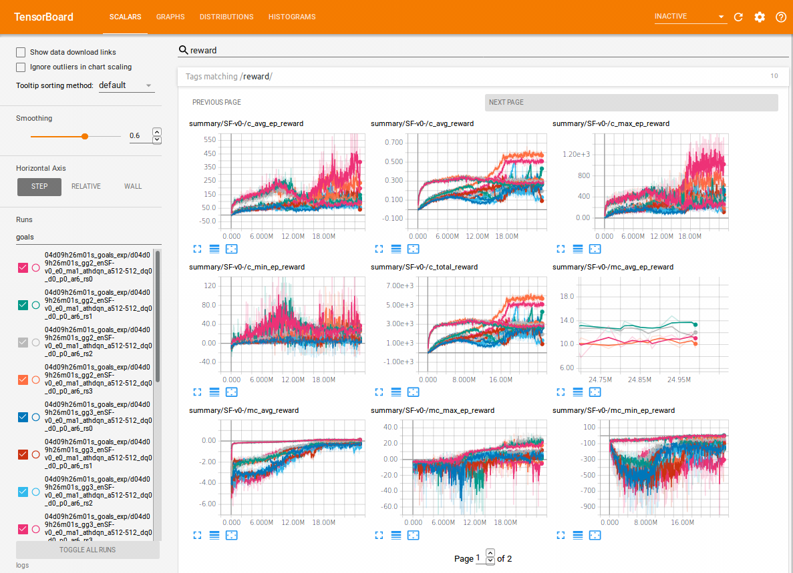

# Hierarchical Reinforcement Learning
The purpose of this project is to use Hierarchical Deep Reinforcement Learning to solve the Space Fortress Game using Tensorflow. As a toy example a simple deterministic MDP environment is created, in which a goal directed-behaviour is required.

The [DQN](https://www.nature.com/articles/nature14236) will be used as baseline with the extensions [Double Q learning](https://arxiv.org/abs/1509.06461), [Dueling architecture](https://arxiv.org/abs/1511.06581) and [Prioritized Experience Replay](https://arxiv.org/abs/1511.05952). This will be compared with another extension to handle options as actions via [**h-DQN**](https://arxiv.org/abs/1604.06057).

Reference code:
 - https://github.com/EthanMacdonald/h-DQN
 - https://github.com/devsisters/DQN-tensorflow
 - https://github.com/DerkBarten/SpaceFortress
 - https://github.com/cmusjtuliuyuan/RainBow
## Set up
Space Fortress libraries such as Cairo need to be installed as it is described in [this repo](https://github.com/DerkBarten/SpaceFortress).
Once the game has been compiled, the file(s) `sf_frame_lib_mines0.so` and `sf_frame_lib_mines1.so` should be located in [Environments/SpaceFortress/gym_space_fortress/envs/space_fortress/shared](Environments/SpaceFortress/gym_space_fortress/envs/space_fortress/shared)
This project is implemented in python 3.6 using tensorflow 1.8.

## Examples

Play as a human to see if the game is ready:

`python main.py --agent_type=human --env_name=SF-v0 --render_delay=42`

Train an DQN agent

`python main.py --agent_type=dqn --env_name=SF-v0 --scale=5000 --double_q=1 --dueling=1 --pmemory=1 --architecture=128-128-128`

Train a Hierarchical DQN agent

`python main.py --agent_type=hdqn --env_name=SF-v0 --scale=5000 --double_q=1 --dueling=1 --pmemory=0 --goal_group=2`

The hyperparameters available from command line are listed in `main.py` and will overwrite the default values of all the available hyperparameters, which are listed in `configuration.py`.
The training will automatically generate the tensorboard logs and checkpoints of the network/s weights. It will record videos of the last steps of the game. For each run, in the logs folder the files `watch0` and `record0` are created. These can be renamed back and forth to `watch1` (to visualize the training in a window) and `record1` (to generate videos) at any point during training.

## Others

The project is not finished because I still have to run some experiments. Here is a gameplay of the agent
https://www.youtube.com/watch?v=-PKxXXtKZdQ

This projects makes an extensive use of tensorboard to visualize various learning metrics

One graph of the Hierarchical Reinforcement Learning agent:

