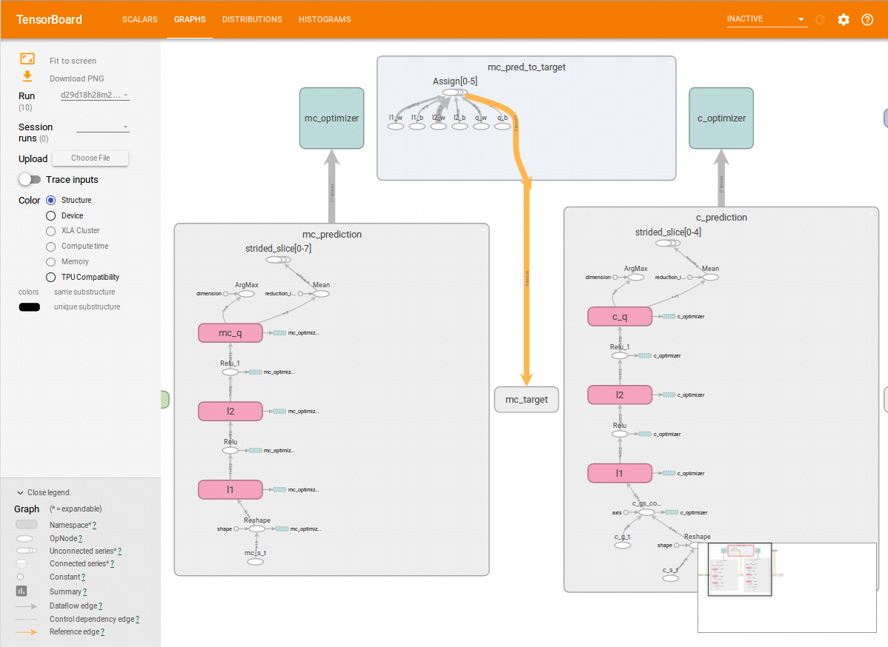

# Hierarchical Reinforcement Learning
The purpose of this project is to use Hierarchical Deep Reinforcement Learning to solve the Space Fortress Game using Tensorflow. As a toy example a simple deterministic MDP environment is created, in which a goal directed-behaviour is required.

The [DQN](https://www.nature.com/articles/nature14236) will be used as baseline with the extensions [Double Q learning](https://arxiv.org/abs/1509.06461), [Dueling architecture](https://arxiv.org/abs/1511.06581) and [Prioritized Experience Replay](https://arxiv.org/abs/1511.05952). This will be compared with another extension to handle options as actions via [**h-DQN**](https://arxiv.org/abs/1604.06057).

Reference code:
 - https://github.com/EthanMacdonald/h-DQN
 - https://github.com/devsisters/DQN-tensorflow
 - https://github.com/DerkBarten/SpaceFortress
 - https://github.com/cmusjtuliuyuan/RainBow

The project is not finished because I still have to run some experiments. Here is a gameplay of the agent
https://www.youtube.com/watch?v=-PKxXXtKZdQ

This projects makes an extensive use of tensorboard to visualize various learning metrics

One graph of the Hierarchical Reinforcement Learning agent:

